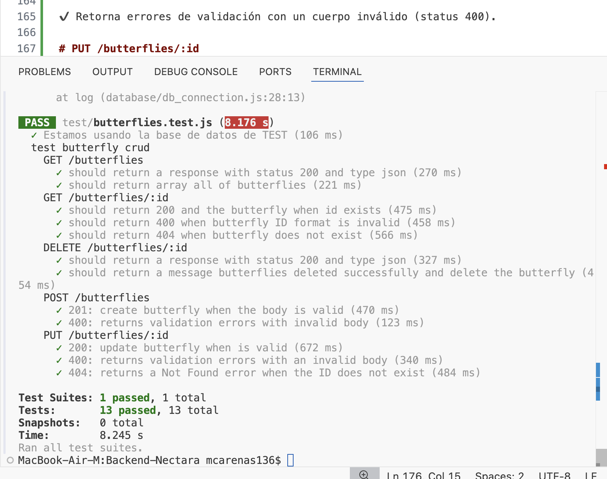
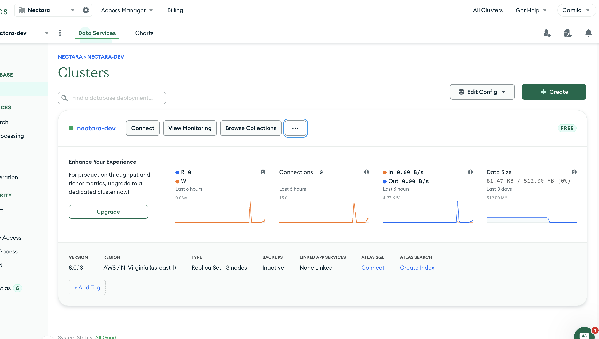
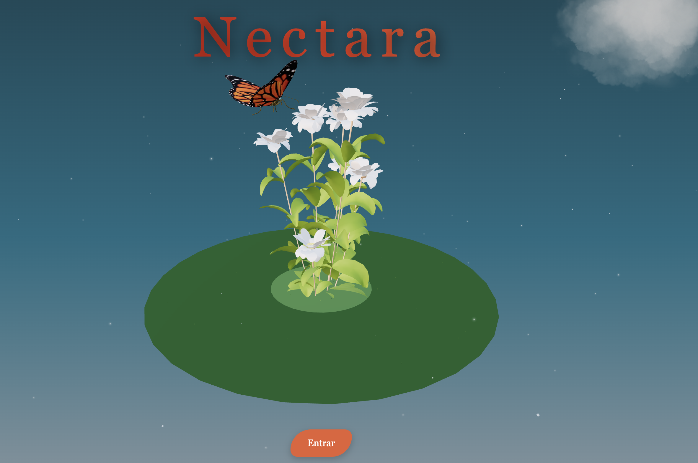
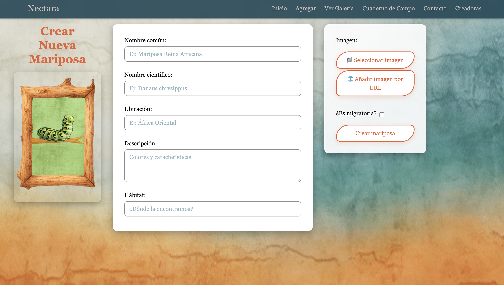

# Nectara

Nectara es una aplicación web completa que te permite explorar el fascinante mundo de las mariposas. Con Nectara, puedes descubrir diferentes especies, aprender sobre ellas e incluso añadir tus propios descubrimientos. La aplicación cuenta con un backend robusto construido con **Node.js**, **Express** y **MongoDB**, y un frontend interactivo y atractivo desarrollado con **React**.

## Tabla de Contenidos
- [Nectara](#nectara)
  - [Tabla de Contenidos](#tabla-de-contenidos)
  - [Tecnologías Utilizadas](#tecnologías-utilizadas)
    - [Backend](#backend)
    - [Frontend](#frontend)
  - [Instalación y Uso](#instalación-y-uso)
    - [Requisitos Previos](#requisitos-previos)
    - [1. Clonar el Repositorio](#1-clonar-el-repositorio)
    - [2. Configuración del Backend](#2-configuración-del-backend)
    - [3. Configuración del Frontend](#3-configuración-del-frontend)
  - [Configuración de MongoDB Atlas (Ejemplo)](#configuración-de-mongodb-atlas-ejemplo)
  - [Vistas de la Aplicación](#vistas-de-la-aplicación)
  - [Créditos y Equipo](#créditos-y-equipo)
  - [Scripts Disponibles](#scripts-disponibles)
    - [Backend](#backend-1)
    - [Frontend](#frontend-1)
  - [Rutas de la API](#rutas-de-la-api)
  - [Funcionalidades Principales](#funcionalidades-principales)
  - [Agradecimientos](#agradecimientos)
---

## Tecnologías Utilizadas

### Backend
* **Node.js**: Entorno de ejecución para JavaScript del lado del servidor.
* **Express**: Framework para construir aplicaciones web y APIs.
* **MongoDB**: Base de datos NoSQL para almacenar la información de las mariposas.
* **Mongoose**: Librería para modelar datos de MongoDB.
* **Cors**: Middleware para habilitar CORS (Cross-Origin Resource Sharing).
* **Dotenv**: Módulo para cargar variables de entorno.
<p align="left">
  
  
  
  
  
</p>

### Frontend
* **React**: Librería para construir interfaces de usuario.
* **React Router**: Para la gestión de rutas en la aplicación.
* **Vite**: Herramienta de desarrollo moderna para frontend.
* **Tailwind CSS**: Framework de CSS para un diseño rápido y moderno.
* **Axios**: Cliente HTTP para realizar peticiones a la API.
* **Framer Motion, React Three Fiber, Drei**: Para animaciones y renderización de modelos 3D.

<p align="left">
  
  
  
  
  
  
  
</p>

---

## Instalación y Uso

### Requisitos Previos
* Node.js (versión 18 o superior)
* npm / pnpm / yarn
* Una cuenta de MongoDB Atlas para la base de datos en la nube.

### 1. Clonar el Repositorio
Primero, clona el repositorio en tu máquina local.
```bash
git clone [https://github.com/API-Nectara/API-Nectara.git](https://github.com/API-Nectara/API-Nectara.git)
cd api-nectara-mongo
```

### ⚙️ Configuración del Backend
Sigue estos pasos desde la raíz del proyecto.

Navega a la carpeta del backend:

```bash
cd Backend-Nectara
Instala las dependencias:
```
```bash
npm install
```
Configura las variables de entorno:
Crea un archivo .env en la carpeta Backend-Nectara y añade tus credenciales:
```bash
MONGODB_URI=<Tu URI de MongoDB>
DB_NAME=<El nombre de tu base de datos>
PORT=8080
```
Inicia el servidor:

```bash
node app.js
```
El servidor se iniciará en http://localhost:8080.

🎨 Configuración del Frontend
Abre una nueva terminal y sigue estos pasos desde la raíz del proyecto (api-nectara-mongo).

Navega a la carpeta del frontend:

```bash
cd Frontend-Nectara
```
Instala las dependencias:

```bash
npm install
```
Inicia la aplicación cliente:

```bash
npm run dev
```
La aplicación se abrirá en tu navegador, generalmente en http://localhost:5173.

## Configuración de MongoDB Atlas (Ejemplo)
Aquí puedes ver un ejemplo de cómo debería quedar tu configuración en MongoDB Atlas para obtener la URI de conexión.

## Tests Automatizados ✅ 

El backend de Nectara cuenta con una suite de tests automatizados implementados con Jest y Supertest para garantizar la calidad y el correcto funcionamiento de la API.

Ejecución de Tests

Para correr todos los tests del proyecto:

```bash
cd Backend-Nectara
npm test
```
## Cobertura de Tests

Actualmente se cubren las operaciones CRUD principales de la API de mariposas:

### GET /butterflies

✔️ Devuelve todas las mariposas (status 200, formato JSON).

#### GET /butterflies/:id

✔️ Devuelve una mariposa existente (status 200).

✔️ Retorna error si el formato del ID es inválido (status 400).

✔️ Retorna error si la mariposa no existe (status 404).

### DELETE /butterflies/:id

✔️ Elimina una mariposa existente (status 200).

✔️ Confirma la eliminación con un mensaje en JSON.

### POST /butterflies

✔️ Crea una mariposa cuando los datos son válidos (status 201).

✔️ Retorna errores de validación con un cuerpo inválido (status 400).

### PUT /butterflies/:id

✔️ Actualiza una mariposa cuando los datos son válidos (status 200).

✔️ Retorna errores de validación si el cuerpo es inválido (status 400).

✔️ Retorna error si el ID no existe (status 404).

### Resultados de la Suite


Ejemplo de salida en consola al ejecutar npm test:
1.  **Vista del Clúster y Botón "Connect"**


---

## Vistas de la Aplicación
Un vistazo a cómo luce Nectara en acción.

#### Página de Inicio
La primera impresión de nuestra aplicación, con una animación 3D interactiva.


#### Galería de Mariposas


#### Formulario de Creación

---
## Créditos y Equipo
Este proyecto fue posible gracias a la colaboración de dos equipos especializados.

### Equipo de Frontend
* Aday Álvarez
* Anngy Pereira
* Sofia Reyes
* Ana Muruzabal

### Equipo de Backend
* Paloma Gómez
* Gema Yébenez 
* Maryori Cruz
* Ana Muruzabal
* Camila Arenas

---

## Scripts Disponibles

### Backend
* `npm test`: Ejecuta los tests de la API.

### Frontend
* `npm run dev`: Inicia el servidor de desarrollo.
* `npm run build`: Compila la aplicación para producción.
* `npm run lint`: Analiza el código en busca de errores.
* `npm test`: Ejecuta los tests de los componentes.

---

## Rutas de la API

El backend expone las siguientes rutas para gestionar las mariposas:

* **GET `/butterflies`**: Obtiene todas las mariposas.
* **GET `/butterflies/:id`**: Obtiene una mariposa por su ID.
* **POST `/butterflies`**: Crea una nueva mariposa.
* **PUT `/butterflies/:id`**: Actualiza una mariposa existente.
* **DELETE `/butterflies/:id`**: Elimina una mariposa.

---

## Funcionalidades Principales

* **Inicio**: Página de bienvenida con una introducción a la aplicación.
* **Galería de Mariposas**: Explora todas las mariposas disponibles.
* **Detalle de Mariposa**: Visualiza la información detallada de una especie.
* **Crear/Editar Mariposa**: Añade o modifica especies en la base de datos.
* **Sobre Nosotros y Contacto**: Páginas informativas sobre el equipo y cómo contactar al equipo de FrontEnd.
